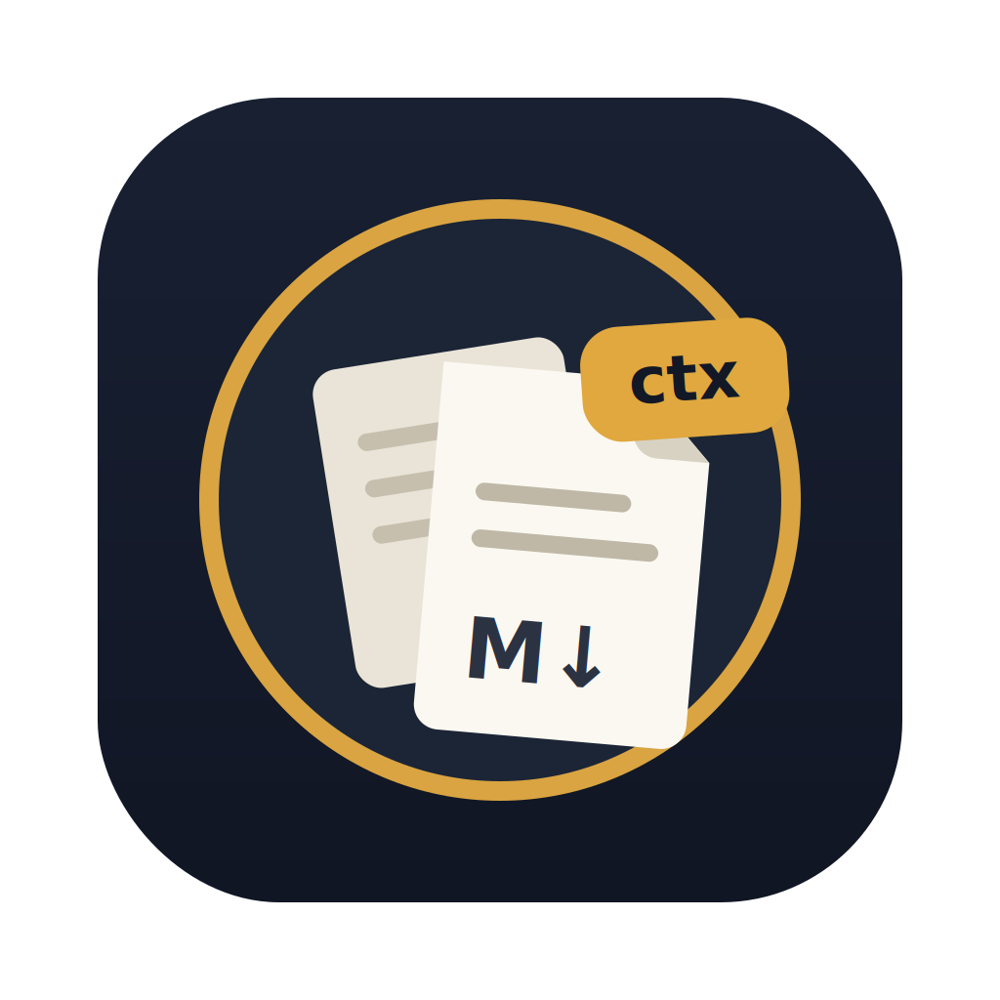

<div align="center">



# Loredex Desktop

**The native control surface for [loredex](https://github.com/ahmedtawfeeq1/loredex) dexes — read the team's knowledge, run the handoff lifecycle, see the whole map, and operate a fleet of client AI-agent deployments. macOS · Windows · Linux.**

[](LICENSE)
[](https://github.com/ahmedtawfeeq1/loredex-desktop/releases/latest)

**loredex ecosystem** &nbsp;·&nbsp; [📖 loredex (CLI + core)](https://github.com/ahmedtawfeeq1/loredex) &nbsp;·&nbsp; **🖥️ Desktop** (you are here) &nbsp;·&nbsp; [🔮 Obsidian plugin](https://github.com/ahmedtawfeeq1/loredex-obsidian)

</div>

---

[Loredex](https://github.com/ahmedtawfeeq1/loredex) turns scattered agent markdown into one shared vault: filed, indexed, and handed off between projects. Loredex Desktop is the native app for living in that vault, on **macOS, Windows, and Linux**. It embeds the same `loredex` npm package the CLI and agents use — **in-process, one engine** — and puts a UI on everything: a reader with working wikilinks, an inbox/outbox board for the full handoff lifecycle (accept / decline / snooze / consume, replies, threads), a zoomable atlas of the whole vault, an API-contract change timeline, live sync against the team's git remote, and an in-app MCP server so agents on your machine read the exact vault state the app shows.

No Obsidian required, no server, no account. The vault stays a plain markdown folder in git.

A dex comes in two types and the app adapts to each: a **research** dex (the
default) is the knowledge workflow described below; an **agent-ops** dex turns
the app into a control room for a fleet of client AI-agent deployments — a
Clients view, embedded terminal, and client-scoped AI chat panels. See
[Agent-ops: operate a client fleet](#agent-ops-operate-a-client-fleet).

## The tour

Nine views, in sidebar order (⌘1–⌘9):

| View | What it does |
|---|---|
| **Home** | The vault's *Start Here* brief with a freshness badge — the curated "what is this work and where do I begin" |
| **Reader** | Vault tree + rendered notes: wikilinks resolve (broken ones become diagnostics, never phantom files), commit SHAs link to the remote, drag a markdown file in to route it |
| **Handoffs** | Inbox/outbox lanes per project. Compose (⌘N), reply, comment; accept / decline-with-reason / snooze-until / consume — every transition attributed in frontmatter and committed. Thread rail shows reply and fulfills lineage |
| **Atlas** | The whole vault as a zoomable SVG graph: Overview → Learn → Deep Dive, tours from reading orders, path tracing, a blocked-on list, changed-since overlay, SVG/PNG export. Every node is a hyperlink — notes open the Reader, handoffs open their thread, commits open GitHub |
| **Contracts** | Timeline of API-contract changes (OpenAPI / Postman / GraphQL files in your registered repos) from git history, with pinned unified diffs and labeled links to related handoffs |
| **Search** | Full-text search with facets: project, topic, type, status, from, to |
| **Activity** | The team's route/handoff/consume/sync history, day-grouped, from vault git log |
| **Sync** | Ahead/behind vs the remote, status warnings, sync now (⇧⌘S) — plus a background poller that fetches every 60 s and integrates only when your work isn't mid-write |
| **Settings** | Appearance, identity profile, contract repos and globs, GitHub (`gh`) integration, MCP server port |

Around the views: create-vault and join-vault wizards (plus `loredex://join` deep links), a first-run screen, native notifications with a dock badge for open handoffs, a ⌘K command palette that lists every action, and a `?` keyboard cheatsheet. Full walkthrough: [docs/USER-GUIDE.md](docs/USER-GUIDE.md).

## Agent-ops: operate a client fleet

Point the app at an **agent-ops** dex (`loredex init --type agent-ops`, or create one in the wizard) and a **Clients** view appears alongside the tour above: your fleet as managers → clients → pipelines/agents → stages. Each client page is the operating console for one deployment.

| Capability | What it does |
|---|---|
| **Add Client** | Terminal-free onboarding — create a client, copy a golden client's standard MCP tooling with per-client env rewrite, paste one token per connection, and run a **live connection probe** (green = a real MCP handshake, not just a held token). |
| **Scaffold** | `+ Pipeline` / `+ Agent` / `+ Stage` create units from the UI (inserting a stage renumbers the rest); an inbox panel consumes intake files (open / keep→randoms / delete). Every write is one attributed commit — no hand-editing dex files. |
| **Snapshots & Versions** | `⧉ Snapshot` versions a pipeline/agent's definition into `_versions/<unit>/<stamp>/`; a Versions section lists them newest-first. Can also capture live platform state via the client's own MCP. |
| **Credentials** | Per-client platform logins in your **OS keychain** (never the dex) — masked rows with Reveal / Copy / Edit / Delete. |
| **Chat Here** | Opens the AI panel in the client's folder (materializing its tooling first if stale), so the session runs with that client's own MCP servers. A `◈ <client>` chip marks scoped sessions; **Always allow `<kind>` for `<client>`** auto-answers matching permission requests. |
| **Open in Terminal** | Drops the embedded terminal at the client's folder — `claude`/`codex` run in place. |

Two side panels ride every dex and come into their own here:

- **AI agent chat** — talk to Claude Code or Codex over ACP: rich markdown, tool-call diffs, usage/cost, slash-command autocomplete, image attachments, cross-provider continuation, and a history dropdown. Pop a conversation into its own window.
- **Embedded terminal** — a VS Code-style terminal (xterm.js) with splits, docked left or bottom.

Everything above is gated to agent-ops dexes — a research dex behaves exactly as it did before.

## Agents read the same vault: in-app MCP

While a vault is open, the app hosts a Streamable HTTP MCP server on `127.0.0.1` (port 52017 by default) with the same tools as `loredex mcp` — `vault_search`, `vault_note`, `handoffs_open`, `handoff_consume`, `product_state`, `vault_store` (plus `vault_snapshot` / `vault_snapshot_list` on agent-ops dexes) — one implementation, two hosts. A discovery file at `~/.loredex/desktop.json` carries the port and a per-install bearer token (owner-read-only, removed on quit). Wiring Claude Code takes one command: see [the MCP section of the user guide](docs/USER-GUIDE.md#mcp-connect-your-agents).

## Install

Download the installer for your OS from the [latest release](https://github.com/ahmedtawfeeq1/loredex-desktop/releases/latest) (files are named `Loredex-<version>-…`). Builds are **unsigned / un-notarized** for now, so every OS shows a one-time first-launch warning — clear it once with the step below, then it opens normally forever after. (Removing the warning for good needs code signing — see [SIGNING.md](SIGNING.md).)

| OS | Download | First launch (one-time) |
|---|---|---|
| **macOS** (Apple Silicon, 14+) | `Loredex-<version>-arm64.dmg` — open, drag **Loredex** to Applications | Gatekeeper says **"damaged"** — it isn't; it's unsigned. See the two commands below. |
| **Windows** (10/11, x64) | `Loredex.Setup.<version>.exe` — run it | SmartScreen: **More info → Run anyway** |
| **Linux** (x64) | `.AppImage` (any distro) or `.deb` (Debian/Ubuntu) | AppImage: `chmod +x Loredex-*.AppImage && ./Loredex-*.AppImage` (needs FUSE: `sudo apt install libfuse2`). deb: `sudo dpkg -i loredex-desktop_*_amd64.deb` |

### macOS — clearing the "damaged" warning

On Apple Silicon, removing the download quarantine is **not enough** — an unsigned app also needs a valid signature, so run both:

```sh
xattr -cr /Applications/Loredex.app
codesign --force --deep --sign - /Applications/Loredex.app
open /Applications/Loredex.app
```

- `xattr -cr` clears the download quarantine.
- `codesign --sign -` applies an **ad-hoc signature**, which satisfies Apple Silicon's "must be signed" rule (this is the piece `xattr` alone misses).

No Terminal? Right-click the app → **Open** → **Open**, or System Settings → **Privacy & Security** → **Open Anyway**.

**Git** is required (vault sync + history); on Windows install [Git for Windows](https://git-scm.com/download/win). On first launch: create a vault, join your team's vault by pasting its git URL, or open an existing loredex folder (**File → Open Vault…**, ⌘/Ctrl+O).

No auto-update — that needs a code-signed app, and these builds are unsigned. Instead the top bar **tells you when a newer release exists** and links to the download; installing it is a re-download, and your vault and settings are untouched (settings live in `app.db` outside the app bundle). Full per-OS walkthrough: [docs/USER-GUIDE.md](docs/USER-GUIDE.md) · [loredex install guide](https://github.com/ahmedtawfeeq1/loredex/blob/main/docs/DESKTOP.md).

## Build from source

```sh
git clone https://github.com/ahmedtawfeeq1/loredex-desktop && cd loredex-desktop
npm install
npm run dev        # launch (a predev script stages Electron-ABI natives automatically)
npm test           # vitest unit + integration suites
npm run test:e2e   # scripted end-to-end drive over the real IPC seam — the release gate
npm run build      # typecheck + electron-vite build
npm run dist       # unsigned installer for the current OS (macOS arm64 locally)
```

The app embeds the `loredex` engine (currently the 2.9.0 agent-ops build, vendored under `vendor/`) — `npm install` resolves it, no sibling checkout needed. Cross-platform installers are produced by CI: tag `vX.Y.Z` and the [release workflow](.github/workflows/release.yml) builds macOS/Windows/Linux on their own runners (native `better-sqlite3` compiles per OS) and attaches every installer to the release.

## Architecture

Three processes, one engine:

```text
┌─ Main ────────────────┐   ┌─ Core host (utilityProcess) ─────────────┐
│ windows, menus, tray, │   │ the ONE `import 'loredex'` site:         │
│ notifications, deep   │──▶│ engine, git, write lock, remote poller,  │
│ links, dialogs        │   │ file watcher, app.db (SQLite), MCP host  │
└───────────┬───────────┘   └────────────────────┬─────────────────────┘
            │ brokers MessagePorts               │ typed invoke/events
┌───────────▼───────────────────────────────────▼─────────────────────┐
│ Renderer (sandboxed React) — views only; talks through one typed    │
│ IPC contract; no Node, no fs, no git                                 │
└──────────────────────────────────────────────────────────────────────┘
```

- **Anti-second-engine rule:** anything that writes vault markdown is a `loredex` lib export shared with the CLI. The app adds read-only view logic and per-user state only — so the app, the CLI, and agents can never disagree about what a write means.
- **State placement:** team-visible truth lives in vault frontmatter (git-first-class); per-user state (read/unread, snooze timers, settings) lives in a local SQLite `app.db` that is disposable by contract; everything else is a recomputed cache.
- **Writes are serialized** through a single write lock; the background poller only integrates remote changes when the lock is free and the worktree is clean.

Full detail: [docs/architecture.md](docs/architecture.md) (+ [the M2 addendum](docs/architecture-m2.md)) and the binding UI spec in [docs/DESIGN.md](docs/DESIGN.md).

## The ecosystem

| Piece | What it is | Where |
|---|---|---|
| **CLI** (`npx loredex`) | Filing, curation, handoffs, sync, MCP — the engine's home | [ahmedtawfeeq1/loredex](https://github.com/ahmedtawfeeq1/loredex) |
| **Claude Code plugin** | Hooks that file findings and inject open handoffs automatically | [loredex `plugin/`](https://github.com/ahmedtawfeeq1/loredex/tree/main/plugin) |
| **Obsidian plugin** | Dashboard, handoff badge, in-app MCP inside Obsidian | [ahmedtawfeeq1/loredex-obsidian](https://github.com/ahmedtawfeeq1/loredex-obsidian) |
| **Desktop** (this repo) | The native ecosystem manager — everything above, one window | here |

## Documentation

| Doc | What's in it |
|---|---|
| [USER-GUIDE](docs/USER-GUIDE.md) | Every view, the wizards, the keyboard map, MCP setup |
| [architecture](docs/architecture.md) | Process model, IPC contract, coding standards |
| [architecture-m2](docs/architecture-m2.md) | Handoff schema v2, app-db, poller, contracts, wizards |
| [DESIGN](docs/DESIGN.md) | The design system — tokens, layout, component rules |
| [BACKLOG](docs/plan/BACKLOG.md) | Captured future work — symptom, cause (file:line), and acceptance criteria per item |

## License

MIT © [Ahmed Tawfeeq](https://github.com/ahmedtawfeeq1)
