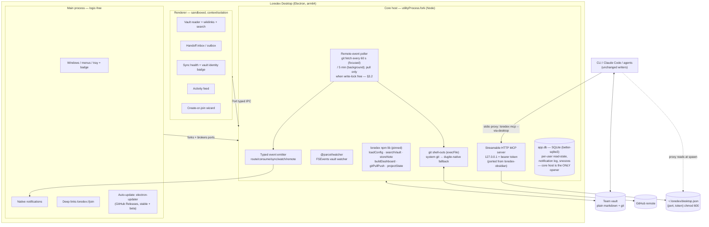

# Loredex Desktop — Build Plan

**Date:** 2026-07-09 · **Target:** macOS, Apple Silicon (arm64) first · **Status:** approved plan, pre-M0

Grounding documents (cited throughout as `[stack]`, `[distribution]`, `[core-reuse]`, `[ux-patterns]`, `[oss-shipping]`, `[bmad]`, `[spec]`, `[sim]`):

| Tag | File |
|---|---|
| `[stack]` | `docs/research/stack.md` |
| `[distribution]` | `docs/research/distribution.md` |
| `[core-reuse]` | `docs/research/core-reuse.md` |
| `[ux-patterns]` | `docs/research/ux-patterns.md` |
| `[oss-shipping]` | `docs/research/oss-shipping.md` |
| `[bmad]` | `docs/research/bmad.md` |
| `[spec]` | `loredex-simulation/DESKTOP-APP-FEATURES.md` |
| `[sim]` | `loredex-simulation/SIMULATION-REPORT.md` (friction refs F1–F10) |

---

## 1. Executive summary

Loredex Desktop is an Electron (arm64-first) macOS app that embeds the published `loredex` npm library in a Node `utilityProcess`, replacing Obsidian as the vault surface and becoming the team's single loredex engine — vault reader, handoff inbox/outbox with notifications, route receipts, create-or-join GitHub wizard, sync health, and activity feed. Electron wins because the core is a Node-only ESM library (`node >= 20`, `node:fs`, `execFileSync` git) that runs in-process unmodified, and because hosting the existing Streamable-HTTP MCP server inside the app kills the F6 vault split-brain by construction `[stack]` `[core-reuse]`. Team-visible handoff lifecycle state lives in vault frontmatter; per-user read/notification state lives in an app-local SQLite DB — the hybrid the UX research and F8 merge evidence both demand `[ux-patterns]` `[sim]`. Ship path: M0 walking skeleton → M1 MVP (the spec's five-pillar cut line, re-baselined to ~14 weeks with GitHub OAuth repo-creation deferred to M2) → M2 handoff system layer → M3 contract intelligence; signed + notarized DMG from GitHub Actions, auto-update via electron-updater against GitHub Releases (public repo from day one), MIT sibling repo, launch CLI-users → Claude Code channels → Obsidian forum → Show HN `[distribution]` `[oss-shipping]`.

---

## 2. Stack decision

### 2.1 Decision table

Scores 1–5 per criterion, weighted. Criteria and scores are taken directly from `[stack]` (Hopp benchmark numbers, Node-runtime analysis, ecosystem audit) and `[core-reuse]` (embedding mechanics).

| Criterion (weight) | Electron 43.x | Tauri v2 | Swift/SwiftUI + Node sidecar | Flutter desktop |
|---|---|---|---|---|
| Reuse of loredex core unmodified (×5) | **5** — main/utilityProcess IS Node 22+; ESM lib imports directly `[core-reuse §2]` | 2 — Node sidecar required; vercel/pkg deprecated, Node SEA needs CJS entry vs ESM-only lib `[stack §1]` | 2 — same sidecar problem plus Swift↔Node RPC seam | 1 — no TS reuse at all `[stack]` |
| F6 split-brain fix by construction (×5) | **5** — one in-process engine, one config resolution, MCP server in-app `[core-reuse §6-7]` | 2 — engine behind an IPC/process boundary reintroduces split-brain class bugs `[stack risks]` | 2 — same | 1 |
| Footprint / RAM (×2) | 2 — ~250 MB installed, ~409 MB RAM (Hopp, Apr 2025) `[stack §2]` | 4 — 8.6 MiB / ~172 MB, but +~100 MB Node sidecar here erases most of it `[stack §1-2]` | 5 | 3 |
| Native macOS feel (tray, badge, notifications, vibrancy) (×3) | 4 — first-class BrowserWindow/Tray/Notification APIs `[stack §3]` | 3 — plugin assembly required | 5 — true AppKit | 2 — Skia, non-native |
| Solo-maintainer velocity (TS everywhere, one build system) (×4) | **5** — one language, electron-vite/electron-builder, web UI skills `[stack §5]` `[oss-shipping]` | 3 — Rust + TS + sidecar packaging per triple | 1 — two languages, two toolchains | 2 |
| Signing/notarization/auto-update maturity (×3) | 4 — electron-builder + electron-updater against GitHub Releases (free for public OSS) `[distribution]` `[oss-shipping]` | 5 — most turnkey (`tauri build` auto-notarizes) `[stack §4]` | 3 — Sparkle, manual wiring | 3 |
| Ecosystem precedent for this app class (×2) | **5** — Obsidian, Linear, VS Code, Slack, Claude Desktop all Electron (May 2026 audit) `[stack §6]` | 3 — Tauri wins are browser-safe/Rust cores (Hoppscotch, Spacedrive) | 3 — Raycast (launcher-class, different needs) | 1 |
| **Weighted total (max 120)** | **108** | 70 | 64 | 41 |

### 2.2 Winner: Electron — argued

**The deciding constraint is not footprint, it is the runtime.** loredex v2.0.0 is a Node-only ESM library (`"type": "module"`, `engines.node >= 20`, `node:fs`, `execFileSync('git', …)`, gray-matter, `@modelcontextprotocol/sdk`) — verified against `loredex/package.json` and `src/lib.ts`. Electron is the only shell where that library runs in-process, unmodified, today `[stack §1]`. Every alternative pays for its smaller bundle with a Node sidecar (~85–110 MB arm64, deprecated pkg or CJS-only SEA packaging) **plus** an RPC seam through every single feature — and the simulation's single most dangerous finding (F6: MCP and CLI silently serving *different vaults*) is precisely the class of bug that seam breeds `[sim F6]` `[core-reuse §2]`.

The footprint criticism is real but bounded: the app **replaces Obsidian, which is itself Electron** — the target users' existing RAM baseline. Honest numbers go in the FAQ (~250 MB installed vs Tauri's ~110 MB with sidecar; ~409 vs ~172 MB RAM) `[stack §2]` `[oss-shipping risks]`.

The proof of embeddability already exists: `loredex-obsidian` runs `createLoredexMcpServer` + `StreamableHTTPServerTransport` on `127.0.0.1` with bearer auth inside another app's process in ~70 lines. The desktop app is the second consumer of the exact same seam `[core-reuse §1]`.

**arm64-first stance:** ship arm64-only. macOS 26 Tahoe is the final Intel release (4 Intel models), macOS 27 (late 2026) is Apple Silicon-only, Rosetta 2 sunsets after 27, and GitHub's last x86_64 macOS runner dies Aug 2027. Universal2 roughly doubles the Electron bundle for a vanishing audience `[distribution]`. Escape hatch if a straggler appears: one-off `macos-15-intel` runner build (available until Aug 2027).

**Toolchain:** electron-vite + **electron-builder** (arm64 dmg/zip, electron-updater — one stack end to end; Forge dropped because update.electronjs.org/Squirrel is stable-channel-only and we need a beta channel, see §6), Electron pinned to a major, dependabot + CI on the 8-week Electron cadence `[stack recommendation]` `[core-reuse §7]`.

**Revisit trigger:** only if the core is ever ported to browser-safe/Rust code, or for a future standalone lightweight menu-bar companion `[stack §8]`.

---

## 3. Architecture

### 3.1 Component diagram



### 3.2 Process model

Three processes, per `[core-reuse §7]`:

| Process | Owns | Explicitly does NOT own |
|---|---|---|
| **Main** | Windows, menus, tray icon + badge count, native `Notification`, deep links (`loredex://join?...`), auto-update, forking the core host and brokering `MessagePortMain` pairs | Any business logic, any vault I/O |
| **Core host** (`utilityProcess.fork`) | `import`s the `loredex` lib directly; config resolution (exactly once); all git/`claude`/`codex` shell-outs; the remote-event poller; `@parcel/watcher` vault subscription; the Streamable HTTP MCP server; the discovery-file writer; **`app.db` (better-sqlite3) — the only process that opens SQLite** | UI; blocking never touches the window (F5 40–60s curate spawns and slow `git pull`s are confined here; crash = respawn, windows unaffected) |
| **Renderer** (sandboxed) | All views; talks to core host over MessagePort through a thin typed wrapper (read-state reads/writes are IPC calls, never direct DB access) | Direct `fs`/`child_process`/SQLite access (contextIsolation + sandbox on) |

**Git strategy** `[core-reuse §4]`: keep loredex's `execFileSync('git', …)` untouched (dugite/GitHub Desktop precedent for CLI-over-libgit2; nodegit dead since 2020; isomorphic-git can't do the custom merge driver). Resolve the binary once at startup — system git, falling back to bundled `dugite-native` (fresh Macs without Xcode CLT otherwise get Apple's CLT dialog). Identity is injected per-command via `git -c user.name/-c user.email` from the app's managed identity profile — never ambient global config (F7 "auth is ambient" `[sim §6]`).

**File watching** `[core-reuse §5]`: `@parcel/watcher` (FSEvents, darwin-arm64 prebuilds, VS Code's choice), ignore `.git/**`, debounce, reconcile from filesystem+git truth after `git pull` event storms — never trust cached per-file events (avoids re-creating the F4 watcher/route race). Its `writeSnapshot`/`getEventsSince` is the "what changed since last brief" primitive (F5).

**MCP hosting** `[core-reuse §6]`: port `loredex-obsidian`'s `LoredexHttpServer` verbatim — bind `127.0.0.1` only, validate `Origin` (MCP spec MUST; CVE-2025-66416 precedent), per-install bearer token, publish `{port, token, engineVersion, schemaVersion}` to `~/.loredex/desktop.json` (chmod 600). **Discovery mechanics (decided):** a static `.mcp.json` cannot read a discovery file, so templated repo configs never embed a URL. Instead they invoke `loredex mcp --via-desktop` — a thin stdio↔HTTP proxy added to the CLI (new loredex PR, see lib work-plan below) that reads `~/.loredex/desktop.json` at spawn time, forwards stdio MCP traffic to the app's HTTP endpoint with the bearer token, and exits loudly with a `loredex doctor` hint when the app isn't running or the token is stale. The app claims a fixed preferred port (default `52017`); if the port is taken it does **not** silently `listen(0)` — it surfaces a loud sync-health error with a settings override, and whatever port is actually bound is what the discovery file records, so the proxy keeps working under a custom port. A `loredex doctor` check on the discovery file ships alongside. Plain stdio MCP (`loredex mcp`) stays with the CLI for app-less use; same `createLoredexMcpServer` factory, two hosts, zero duplicated tool logic.

**Remote-event loop (designed):** local FSEvents can't see other machines, so the core host runs a poller: `git fetch` (never pull) every **60 s while a window is focused, every 5 min in tray/background** — fetch is read-only on the working tree, so it is always safe against concurrent CLI/agent writes. Notification events (new handoff, consume, state change) are parsed from `git log ..origin/<branch>` on the fetched ref **without merging**, so the sender-notification path never has to win a race. Actually integrating (`git pull`) is gated by a core-host **write lock**: every lib write operation (route, consume, store, sync) takes the lock; the poller pulls only when the lock is free and the working tree is clean, then runs the standard reconcile-from-filesystem + regenerate-indexes pass (F4 rule). If the tree stays dirty (agent mid-write), pull defers to the next tick and sync health shows "behind N, integrating…". CLI/agent writes that race the pull are protected by git itself (loredex already shells out per-operation; the lock only serializes the app's own writes against its own pull). This component, its cadence, and its risk entry are in §3.1 and §8 risk 12; the consume-notification success metric is aligned to the fetch cadence (≤ 2 min, §10).

**How the lib is embedded:** `loredex` is a pinned, exact-version npm dependency of the app (sibling-repo pattern proven by `loredex-obsidian` `[oss-shipping]`). The app calls the published surface — but that surface today is smaller than the IPC contract needs. Verified against `loredex/src/lib.ts`, the published exports are exactly: `loadConfig`/`saveConfig`/`defaultVaultPath`, `parseDoc`/`serializeDoc`, `rebuildIndexes`, `buildDashboard`/`collectProductHandoffs`/`listProjects`/`projectState`/`renderDashboardMarkdown`, `ensureGeneratedMergeDriver`/`gitAutoCommit`/`gitPullPush`, `searchVault`/`sanitizeForContext`, `storeNote`, `inboxPath`/`scaffoldVault`/`slugify`, `createLoredexMcpServer`/`resolveNoteInsideVault`, plus the `PRODUCT_BRIEF_NAME` constant and the exported types (`Config`, `Doc`, `Meta`, `ProductDashboard`, `ProductHandoff`, `ProjectState`, `SearchHit`, `StoreInput`). Everything else the app needs is new lib work, planned per operation below.

**Hard rule (anti-second-engine):** any operation that *writes* vault markdown/frontmatter MUST be implemented as a loredex lib export the CLI shares — the app never reimplements a write path. App-side implementation is permitted only for read-only view concerns and non-vault I/O (GitHub API, SQLite, rendering).

Per-operation lib work-plan (every §3.3 `CoreApi` op mapped against the actual `lib.ts` exports):

| §3.3 op | Exists today? | Plan | Writes vault? |
|---|---|---|---|
| `config.get` | ✅ `loadConfig` | use as-is | no |
| `vault.readNote` | ✅ `parseDoc` + `resolveNoteInsideVault` | use as-is | no |
| `vault.search` | ✅ `searchVault` | use as-is | no |
| `vault.resolveLink` | ❌ | **app-side** — pure read-only view logic (Obsidian shortest-path algo); justified: renders links, never touches files | no |
| `handoffs.list` | ⚠️ `collectProductHandoffs` is product-scoped | **loredex PR-1** `listHandoffs(scope)` — generalize the existing collector; CLI `loredex handoffs` gets it too | no |
| `handoffs.consume` | ❌ (CLI-internal today) | **loredex PR-2** `consumeHandoff(id, identity)` — extract from CLI command into `core/`, export; CLI rewired onto the same export; carries `loredex_schema:` bump (§3.4, M1) | **yes → lib** |
| `route.preview` / `route.undo` | ❌ (routing lives in CLI/store internals) | **loredex PR-3** `routeNote` split into plan/apply + receipt object; undo replays the receipt inverse; CLI rewired onto it | **yes → lib** |
| `sync.status` | ❌ (`gitPullPush` is act-only) | **loredex PR-4** `syncStatus()` — ahead/behind, branch/remote match, surfaced warnings; read-only `git` queries | no |
| `sync.run` | ✅ `gitPullPush` | use, plus **loredex PR-5** async variants of `core/router.ts` git calls + structured `SyncReport` (was "additive change 1") | **yes → lib** (already lib) |
| `dashboard.build` | ✅ `buildDashboard` | use as-is | regenerated files → already lib |
| `vault.createOrJoin` | ⚠️ `scaffoldVault` exists | scaffold/registry writes via lib (**PR-7** below); GitHub repo creation + deep-link parsing **app-side** — network + UI, zero vault writes | scaffold → lib |
| `activity.feed` | ❌ | **loredex PR-6** `parseActivity(gitLog)` — read-only, but lives in lib so CLI/app share one event grammar | no |
| *(cross-cutting)* | ❌ | **loredex PR-7** registry-in-vault: config resolution reads the vault registry, CLI support + `config.json` migration (feature 12 — a loredex-core release, not an app feature); **PR-8** injectable event emitter (was "additive change 2"); **PR-9** `loredex mcp --via-desktop` stdio proxy; **PR-10** `loredex doctor` discovery-file + engine/schema handshake checks | PR-7 **yes → lib** |

Scheduling: PR-5, PR-8, PR-9, PR-10 land in M0; PR-1–PR-4, PR-6, PR-7 land across M1 **before** their consuming app features — this is real, budgeted lib work (~4 of M1's 14 weeks), not "two additive changes". The two CLI-side bug fixes the spec says must not wait for the app `[spec MVP note]` — the malformed `gitattributes` pattern (F8) and the `npx -y loredex@latest` brief footer (F6) — are **already fixed in loredex source** (`core/router.ts` writes the quoted pattern and migrates away the broken rule; `commands/handoff.ts` footers now use the project-local `loredex` invocation): M0 only verifies both fixes are in the pinned published release.

### 3.3 IPC contract sketch

Hand-rolled typed channel map (~100–200 lines). Goal state: all payload types imported via `import type {...} from 'loredex'` so the lib's published `.d.ts` is the single source of truth. Honest current state: of the contract's payload types only `Config`, `Doc`, `SearchHit`, `ProductDashboard`, `ProjectState` exist in `lib.ts` today (it also exports `Meta`, `ProductHandoff`, `StoreInput`, unused by this contract); `HandoffCard`, `ConsumeReceipt`, `RoutePreview`, `SyncHealth`, `SyncReport`, `ActivityEvent`, `Identity` ship with lib PR-1–PR-6 (§3.2 work-plan), and `WizardInput`/`LinkResolution`/`Facets` are app-local view types. electron-trpc rejected: single maintainer, 18-month release gap, main-process-router assumption, measured serialization overhead `[core-reuse §3]`.

```ts
// shared/ipc-contract.ts — the entire seam
import type { Config, Doc, SearchHit, ProductDashboard, ProjectState } from 'loredex'

interface CoreApi {                       // renderer → core (request/response)
  'config.get':        { in: void;                          out: Config }
  'vault.readNote':    { in: { path: string };              out: Doc }
  'vault.search':      { in: { q: string; facets?: Facets };out: SearchHit[] }
  'vault.resolveLink': { in: { link: string; from: string };out: LinkResolution }  // Obsidian shortest-path algo [ux-patterns]
  'handoffs.list':     { in: { scope: 'inbox'|'outbox'|'all' }; out: HandoffCard[] }
  'handoffs.consume':  { in: { id: string; identity: Identity }; out: ConsumeReceipt }
  'route.preview':     { in: { file: string };              out: RoutePreview }    // F4 receipt
  'route.undo':        { in: { receiptId: string };         out: void }
  'sync.status':       { in: void;                          out: SyncHealth }      // ahead/behind, branch, remote, warnings
  'sync.run':          { in: void;                          out: SyncReport }
  'dashboard.build':   { in: void;                          out: ProductDashboard }
  'vault.createOrJoin':{ in: WizardInput;                   out: WizardResult }
  'activity.feed':     { in: { since?: string };            out: ActivityEvent[] } // typed events from git log
}

type CoreEvent =                          // core → renderer (push, one channel)
  | { kind: 'handoff.new';      handoff: HandoffCard }      // F1 notifications
  | { kind: 'handoff.stateChanged'; id: string; from: Status; to: Status; by: Identity }
  | { kind: 'route.completed';  receipt: RoutePreview }
  | { kind: 'vault.changed';    paths: string[] }
  | { kind: 'sync.changed';     health: SyncHealth }
  | { kind: 'git.warning';      text: string }              // F8: surface stderr, never swallow

// generic wrappers on both sides:
invoke<K extends keyof CoreApi>(ch: K, arg: CoreApi[K]['in']): Promise<CoreApi[K]['out']>
onEvent(cb: (e: CoreEvent) => void): Unsubscribe
```

### 3.4 Where lifecycle state lives — decided

The spec's open question #2 is decided: **hybrid, with a hard rule.**

| State | Lives in | Why |
|---|---|---|
| Handoff lifecycle (`open → accepted → in_progress → delivered → acknowledged`, `declined` + reason), `kind:`, `replies_to:`/`closes:`/`fulfills:` edges, consume who/when, commit/PR chips | **Vault frontmatter** | Team-visible truth must stay CLI/agent/git-first-class and offline-mergeable — "vault is the whole truth" is the product's core property `[spec Q2]`. These are small closed-vocabulary scalar fields with effectively one writer per transition (the actor), so merge pressure is low. |
| Per-user read/unread, notification log, snoozes, badge state, UI prefs, subscriptions | **App-local SQLite** (`app.db`, per machine, never synced) | Linear's read(U)/lifecycle split is the proven model `[ux-patterns]`; per-user churny state in shared YAML would multiply merge conflicts in a 12-writer vault — the simulation already broke the merge driver once (F8) and hand-edited "do not edit" indexes (F4) `[sim]`. |
| Derived views (chains, dependency graph, activity feed, search index) | **Recomputed cache** | Always rebuilt from filesystem + git; never authoritative (F4 race lesson: reconcile, don't cache `[core-reuse risks]`). |

Hard rule: **nothing the team needs to see may live only in the app DB; nothing per-user may live in the vault.** The app remains a disposable view over a plain-markdown vault — deleting `app.db` loses read-state only.

**Schema + engine versioning (M1, not M2):** feature 8 (consume with identity/timestamp) already changes the frontmatter schema in M1, so the version key ships with it, not after it. Every note the engine writes carries `loredex_schema: <n>`; the vault root carries `.loredex/engine.json` (`{minEngine, schema}`) written on scaffold/migration. Handshake: the app (pinned engine) and `loredex doctor` (whatever CLI version is running) both compare their supported schema against the vault's declared schema **and** against each other via the discovery file's `engineVersion`/`schemaVersion` fields — material mismatch (CLI floats via `npx -y loredex@latest` while the app pins exact) produces a loud warning in sync health and in `doctor`, closing the version-skew split-brain that pin-vs-float otherwise leaves open.

### 3.5 GitHub auth for repo creation — researched stance

The wizard's *create-a-GitHub-repo* half needs auth from a distributed OSS desktop app, which forbids the classic OAuth web flow: **a client secret cannot ship in a public-repo binary.** Decision: **GitHub Device Flow** (OAuth device authorization grant) — GitHub supports it for OAuth apps with the client ID alone, no secret, and it is the established pattern for `gh` CLI-class tools. Scope: `repo` (classic scope; required for private-repo creation — fine-grained PATs can't be minted via OAuth, and `public_repo` alone would surprise teams defaulting to private vaults). Token storage: Electron `safeStorage` (Keychain-backed) — never plaintext on disk, never in the vault. Failure UX: device-flow declined/timed out/enterprise-blocked → wizard falls back to "paste an existing repo URL" (the M1 create path, which needs no OAuth at all). Rate/verification constraints (user-code expiry, 5s polling minimum) handled per GitHub's device-flow docs. A dedicated research spike validating this against a real OAuth app registration is the **first pre-M2 story**; no M2 wizard story is authored before it lands.

---

## 4. Feature plan

Every **must** from `[spec]` appears. Estimate scale: S ≤ 3 days, M ≤ 2 weeks, L > 2 weeks (solo maintainer + agents).

| # | Feature | Spec priority | Evidence | Milestone | Est. |
|---|---|---|---|---|---|
| 1 | Rendered vault browser, resolved + project-disambiguated wikilinks (Obsidian shortest-path algo, hover previews, broken links as diagnostics — never auto-create) | must | F9 `[ux-patterns]` | M1 | L |
| 2 | Full-text + frontmatter-facet search (project/topic/type/status/from/to) | must | F5, PM grep archaeology | M1 | M |
| 3 | Product home: rendered Start Here, SHAs hyperlinked, freshness badge, one-click re-curate, "changed since last brief" diff (watcher snapshot API) | must | F5/F9 `[core-reuse §5]` | M1 | M |
| 4 | Route receipt + undo: file → exact destination, invented-frontmatter diff, content-hash dedupe with one-click merge | must | F4 (only friction that *damaged* the vault) | M1 | M |
| 5 | Filing scope control: never-route globs, confirm before routing frontmatter-less files | must | F4 (FINDINGS.md silently published) | M1 | S |
| 6 | Drift badges: "vault copy N commits behind source", one-click re-route, local-vs-pushed indicator | must | F4 (route-once staleness ×3) | M1 | M |
| 7 | Handoff inbox + outbox board, company-wide view, one-click brief open with reading order resolved | must | F1 + F5 (biggest hole; sender blind) | M1 | L |
| 8 | Consume with identity + timestamp + sender notification — **ships the `loredex_schema:` version key with it** (§3.4; this is M1's schema change, versioned from day one) | must | F1 (consume is anonymous) | M1 | M |
| 9 | New-handoff native notification | must | F1 (mobile: "single highest-value feature") | M1 | S |
| 10 | Sent-handoff state-change notification | must | F1 (sender never finds out today) | M1 | S |
| 11a | Create-or-join vault wizard, no-OAuth cut: join = link/deep-link encoding remote + branch + registry, batch-register repos; create = scaffold vault + connect an **existing** GitHub repo by pasted URL + canonical branch + push | must | F7 + `[sim §6]` GitHub addendum | M1 | L |
| 11b | Wizard create-with-OAuth: in-app GitHub repo creation via device flow (§3.5) | must (spec) — deferred from M1 to de-risk auth | F7 | M2 | M |
| 12 | Shared project registry stored in the vault (replaces per-machine config.json as truth) — **a coordinated loredex-core release (lib PR-7: config-resolution change + CLI support + config.json migration), consumed by the app; not an app feature** | must | F7 (clone = dead vault) | M1 (loredex release lands mid-M1, app adopts) | L |
| 13 | Sync health panel: remote reachable, branch match, ahead/behind, last push/pull, merge-driver status, surfaced git warnings | must | F5/F8 (would have caught gitattributes day one); GitHub Desktop sync widget pattern `[ux-patterns]` | M1 | M |
| 14 | Always-visible vault identity badge (vault, config, remote — in chrome and MCP responses) | must | F6 ("most dangerous failure mode") | M0 | S |
| 15 | Activity feed: typed identity-attributed events from vault git log (route/consume/handoff/sync), day headers, avatars | should (spec) / MVP pillar 5 | F5; GitHub Desktop History pattern `[ux-patterns]` | M1 | M |
| 16 | Status lifecycle beyond open/consumed (accepted/in-progress/delivered/acknowledged/declined-with-reason; Linear triage verbs) | must | F1/F3 `[ux-patterns]` | M2 | M |
| 17 | Request-vs-delivery kinds + threading (`kind:`, `replies_to:`, `closes:`, inline reply) | must | F3 (mobile faked a question as delivery) | M2 | M |
| 18 | Chain / lineage view (ancestry graph per handoff) | must | F3; frontend reconstructed 3-team lineage by hand | M2 | M |
| 19 | Dependency / blocked-on view, `--fulfills`/`--unblocks` at creation | must | F3 (invisible critical path) | M2 | L |
| 20 | Commit/PR chips on handoffs, both directions, SHAs verified + hyperlinked | must | bare prose SHAs in every brief `[sim §2]` | M2 | M |
| 21 | Contract-file registry (declared owned artifacts per project, warn on foreign-file next-actions) | must | F2 (ownership by prose convention) | M3 | M |
| 22 | Endpoint/contract diff viewer per handoff (before/after delta pinned to commit) | must | F2 (briefs restate contracts in English) | M3 | L |
| 23 | Contract-change timeline + queued-changes lane + same-file conflict warning | must | F2 (3 mutations/day discoverable only via prose) | M3 | M |
| 24 | Managed identity profiles (drives all attribution, git `-c` injection) | should | F7; attribution backbone `[core-reuse §4]` | M2 | M |
| 25 | Scope preview/editor at handoff time (untick notes, "internal never hand off") | should | F10 (7-note oversweep) | M2 | M |
| 26 | Handoff target picker (registered projects, replaces free-text `--to`) | should | F10 (ghost projects) | M2 | S |
| 27 | Sync transparency (preview what sync will push/pull) | should | "three checkmarks and nothing else" | M2 | M |
| 28 | One-click "commit loredex wiring" to repos | should | F7 (untracked wiring files ×4 by hand) | M2 | S |
| 29 | PR-merged → handoff auto-transition (commit trailer / webhook) | should | backend typed 97d4b73 by hand | M3 | M |
| 30 | openapi ↔ Postman parity check | should | pre-existing drift found day zero | M3 | M |
| 31 | Endpoint registry / subscriptions | should | "subscription surface, not repo archaeology" | M3 | L |
| 32 | Staleness/upstream-change nudges + promise tracking | should | keep-alive ping deferred silently | M3 | M |
| 33 | Layered ownership model (schema vs API-surface owner) | should | curate flagged real ambiguity | M3 | S |
| 34 | Per-channel integration cards (secret *names* only) | should | F10 (ops knowledge homeless) | M3 | M |
| 35 | Default-branch badge on referenced commits | should | PM can't verify "shipped" merged | M3 | S |
| 36 | Declared product objective | should | brief never answers "are we on track" | M2 | S |
| 37 | Compose-time gap linting; deadline/SLA surfacing; brief-vs-source badge; event-schema registry; canonical-note pin; risk triage; CI contract hook | could | F2/F10 tail | post-M3 backlog | — |

Honesty note on musts vs cut line: features 16–23 are spec **musts** but the spec itself places them *after* the MVP cut line ("ship v1 with open/consumed + who/when, add states once frontmatter schema is settled") `[spec cut line]`. Feature 11b (in-app OAuth repo creation) is additionally deferred to M2 by this revision — it is the least-de-risked M1 item (§3.5) and the pasted-URL create path covers the F7 evidence. M1 = the five pillars minus that one wizard half; M2/M3 complete the musts.

---

## 5. Milestones

Story authoring follows BMAD V4 anatomy with V6 guardrails; Epic 1 is the walking skeleton per the BMAD greenfield rule ("Epic 1 must establish project infrastructure plus a canary feature") `[bmad]`.

### M0 — Walking skeleton (≈ 3 weeks)
Scope: electron-vite + electron-builder scaffold (arm64, **public repo from day one** so the GitHub-Releases update feed is dogfoodable), three-process topology live, core host imports pinned `loredex`, vault identity badge (#14), one note rendered, MCP server ported from loredex-obsidian + discovery file + `loredex mcp --via-desktop` stdio proxy (lib PR-9), signed + notarized CI pipeline from day one (`[core-reuse risks]`: unsigned listener = firewall prompt every launch), `legal/` third-party-notices generation wired into the build (Zed pattern `[oss-shipping]`). Verify the two already-landed loredex CLI fixes (F8 gitattributes, F6 npx footer — fixed in loredex source, §3.2) ship in the pinned release, and land lib PR-5/PR-8/PR-9/PR-10 (async git + SyncReport, event emitter, stdio proxy, doctor handshake) per the §3.2 work-plan.
**Definition of done:** CI on `macos-latest` produces a stapled DMG that passes Gatekeeper on a clean Mac; `spctl -a` clean; Claude Code connects to the in-app MCP endpoint via the discovery file and `vault_search` returns results from the *same* vault the UI shows.
**Demo:** fresh Mac, drag app to /Applications, open the nimbus vault, click a wikilink, run an MCP query from Claude Code — one engine, one vault, badge proves it.

### M1 — MVP: the spec's cut line (≈ 14 weeks, re-baselined)
Scope: features 1–10, 11a, 12–15 — the five pillars `[spec cut line]` minus in-app OAuth repo creation (11b → M2, §3.5): vault reader + search + Start Here home; inbox/outbox + consume with identity (+ `loredex_schema:` key) + native notifications; route receipts + drift badges + never-route globs; join/create wizard (existing-repo create path) + sync health + identity badge; activity feed. Includes the loredex-side releases M1 depends on: lib PR-1–PR-4, PR-6 and the **PR-7 registry-in-vault core release with CLI migration** (feature 12), budgeted at ~4 of the 14 weeks. Re-baseline honesty: the previous 8–10 week figure ignored that features 1–15 sum to ~20+ serial weeks by this plan's own S/M/L scale; 14 weeks assumes agent parallelism on the M/S items while the three L items (reader, inbox/outbox, wizard) and the lib PRs run largely serial through the maintainer. UI patterns per `[ux-patterns]`: GitHub-Desktop-style sync widget, Linear action registry (buttons + single-letter keys + Cmd+K), Things-discipline badge (= open inbound handoffs only).
**Identity caveat (stated, not hidden):** in-app consumes carry app-managed identity; CLI-side consumes remain ambient-git-config until managed identity profiles land in M2 (feature 24) — reflected in the success metric (§9).
**Definition of done:** the Nimbus simulation re-run end-to-end with zero Obsidian installs and zero terminal commands beyond `loredex` CLI writes; every F1/F4/F6/F7/F8/F9 reproduction step from `[sim]` fails to reproduce — automated as the E2E suite's backbone (§7), so the DoD is executable, not ceremonial.
**Demo:** "12-engineer day one": create a vault and connect it to a fresh GitHub repo from the wizard (pasted URL), second machine joins via link, handoff sent from CLI appears as a notification on the other machine within one fetch cadence (≤ 2 min), sender sees the consume with who/when.

### M2 — Handoff system layer (≈ 6–8 weeks)
Scope: features 11b (OAuth repo creation, gated on the §3.5 device-flow spike as the first M2 story), 16–20, 24–28, 36 — lifecycle states + threading (extending the schema already versioned via `loredex_schema:` since M1), chain/lineage + dependency views, commit/PR chips, managed identity, scope preview, target picker, sync transparency, wiring commit.
**Definition of done:** Chain 3 (request → fulfillment) provable from the UI with zero grep: request note → fulfilling handoff → closing state, each hop attributed.
**Demo:** decline a handoff with a reason; watch the sender's outbox flip and the dependency view unblock; open the streaming chain's full lineage graph.

### M3 — Contract intelligence + public launch (≈ 6–8 weeks)
Scope: features 21–23, 29–35 — contract registry, diff viewer, timeline, parity check, endpoint subscriptions, nudges, integration cards. Launch train per `[oss-shipping]`: beta via GitHub pre-releases to CLI users → Claude Code channels → Obsidian forum ("your vault stays Obsidian-compatible") → Show HN (Tue–Thu 9–12 ET); Homebrew personal tap at M1, main-cask submission when stars clear notability.
**Definition of done:** a contract-touching handoff renders a machine diff beside the prose brief, pinned to a verified commit; the F2 "third mutation today" question answerable in two clicks.
**Demo:** the openapi.yaml timeline for the simulated day — three mutations, three handoffs, one queued conflict warning.

---

## 6. Distribution & release plan

All items from `[distribution]` + `[oss-shipping]`.

| Concern | Decision |
|---|---|
| Repo | `loredex-desktop`, sibling MIT repo in the same org, **public from day one** (the GitHub-Releases update feed and M0's auto-update DoD require it; also gates Homebrew and Sentry OSS plan), consumes published `loredex` pinned exact (the `loredex-obsidian` pattern; isolates Apple signing secrets from npm cadence; n8n-desktop thin-wrapper failure noted but this app owns real surface) |
| Min macOS | **macOS 14 (Sonoma)** declared floor (`LSMinimumSystemVersion`) — arm64-only already excludes pre-11 hardware; 14 matches the research's 13/14 recommendation `[distribution]` and current Electron support |
| Identity | Apple Developer Program $99/yr; decide personal-vs-org account **before** the first cert (team name is user-visible) |
| Signing | Developer ID Application, hardened runtime, entitlements: `allow-jit` only (Electron ≥12 needs no `allow-unsigned-executable-memory`); sign inside-out, never `--deep`; bundled dugite git binaries pre-signed individually (the #1 Node-app notarization failure class) |
| Notarization | `notarytool submit --wait`, CI asserts on "Accepted" **status text** (exit code 0 unreliable), 20+ min timeout; staple the .app |
| Artifacts | Stapled drag-to-/Applications **DMG** (primary; Finder move defeats App Translocation) + **ZIP** via `ditto -c -k --keepParent` (required by electron-updater; plain `zip` breaks signatures via NFD/NFC) |
| App Translocation | Detect `/AppTranslocation/` at launch → prompt Move to Applications (otherwise self-update silently breaks) |
| Auto-update | **One stack: electron-builder + electron-updater** against GitHub Releases (`latest-mac.yml` + ZIP artifact; the previously mixed update.electronjs.org/Squirrel path is dropped — it is stable-channel-only and belongs to the Forge stack we're not using). **Beta channel resolved:** electron-updater channels — pre-releases publish `beta-mac.yml` (`channel: beta`), beta opt-in via in-app setting flipping `updater.channel`; stable users never see pre-releases. No TestFlight (MAS sandbox is incompatible with a git-spawning vault manager) |
| Rollback | A bad release is handled by (1) marking the GitHub Release as pre-release/deleted so `latest-mac.yml` points back at the previous good version, and (2) all prior stapled DMGs remain on Releases with a documented re-install path in the README; updater never deletes the previous app version's user data |
| CI | GitHub Actions `macos-latest` (arm64): ephemeral keychain + base64 .p12 (with the mandatory `security set-key-partition-list` step), build → sign → notarize → staple → upload DMG+ZIP+`latest-mac.yml` (or `beta-mac.yml`) to the GitHub Release |
| Versioning | release-please + conventional commits (already loredex's flow); tag merge triggers the signed-build workflow |
| Homebrew | Personal tap (`loredex/homebrew-tap`) at M1; main cask when past notability (~225 stars self-submitted); notarization also gates brew (cask repo requires Gatekeeper pass) |
| Onboarding TCC | NSOpenPanel vault picker grants folder access silently — never cold-scan folders (per-folder TCC prompt ambush), never Full Disk Access |
| Network | MCP binds `127.0.0.1` explicitly (Local Network prompt exempt for loopback; early-Sequoia bugs noted) |
| Telemetry | Opt-in Sentry crash reports only (sponsored OSS plan), no usage metrics at launch, `TELEMETRY.md` published, telemetry never routed through the vault (Audacity-revolt precedent; privacy-vault audience); crash reports scrub filesystem paths and hostnames before send per `[oss-shipping §5]` |
| Legal | `legal/` third-party-notices generation (license bundler) wired into the M0 build (Zed pattern `[oss-shipping]`) |
| Docs | README as the real landing page; Astro Starlight for the unified ecosystem docs site (CLI + app + Obsidian plugin) |

---

## 7. Test strategy

Prerequisite for the BMAD `testing-strategy` shard the stories cite `[bmad]`; every layer has a CI gate from M0.

| Layer | Tooling | What it covers | Gate |
|---|---|---|---|
| Unit | **vitest** (matching loredex's own setup) | IPC contract wrappers, link resolution, activity-event grammar, read-state store, wizard input parsing; lib PRs 1–7 carry their unit tests in the loredex repo | every PR |
| Native-module smoke | CI job on `macos-latest` arm64 | `@parcel/watcher` FSEvents subscribe/emit and `better-sqlite3` open/write against the **packaged** Electron ABI — reruns on every Electron and module bump | every PR + Electron bump |
| MCP contract | vitest + MCP SDK client | Spawn the real core host, connect via `loredex mcp --via-desktop` through the discovery file, assert tool list/results parity with the CLI's stdio server against a fixture vault — the F6 regression net | every PR |
| Merge driver / git | fixture-repo tests (loredex repo) | `gitattributes` pattern (F8 regression), generated-index merge, concurrent-writer pull-reconcile scenarios feeding the poller's write-lock logic | every loredex PR |
| E2E | **Playwright for Electron** | The automated Nimbus F-reproductions (F1, F4, F6, F7, F8, F9 steps from `[sim]` scripted as specs) — M1's Definition of done is this suite passing; plus wizard join flow and update-check smoke | nightly + release |
| Release | CI pipeline asserts | notarization "Accepted" status text, `spctl -a` on the stapled artifact, `latest-mac.yml`/`beta-mac.yml` integrity, DMG opens on a clean runner | every release |

CI matrix: `macos-latest` (arm64) is the only build target; the matrix dimension is Electron current-pinned vs next-major (allowed-failure lane) to front-run the 8-week treadmill (risk 4/5).

---

## 8. Risks

| # | Risk | Likelihood | Impact | Mitigation |
|---|---|---|---|---|
| 1 | **Electron footprint criticism** (~250 MB / ~400 MB RAM) at HN launch and from Tauri partisans | High | Medium | Honest framing: target users already run Obsidian (Electron); publish the Hopp numbers ourselves in a FAQ; single window + tray + lazy views; note the Tauri path here still ships a ~100 MB Node sidecar `[stack §1-2]` `[oss-shipping risks]` |
| 2 | **MCP/CLI split-brain regresses** (F6, "most dangerous failure mode") — including **version-skew split-brain**: the app pins `loredex` exact while users' CLIs float (`npx -y loredex@latest`), so two engine versions can write one vault | Medium | Critical | One in-process engine, config resolved exactly once, discovery file + stdio proxy + `loredex doctor` check, vault identity badge in chrome **and** MCP responses; **engine+schema handshake (§3.4)**: `loredex_schema:` from M1, `.loredex/engine.json`, discovery-file `engineVersion`/`schemaVersion` — app and doctor both warn loudly on material mismatch `[core-reuse §6-7]` `[oss-shipping risks]` |
| 3 | **Vault merge conflicts at 12 writers** (F8 broke the merge driver; F4 index collisions) | High | High | F8 fix ships in loredex first (M0); lifecycle = small closed-vocab frontmatter with one writer per transition; per-user state kept out of the vault (SQLite); app reconciles from filesystem+git truth, regenerates indexes after merge, never hand-merges "do not edit" files `[§3.4]` |
| 4 | **Solo-maintainer bus factor** (Electron 8-week treadmill, cert renewal, notarization stalls) | High | High | Dependabot + CI automation; signing certs only in CI secrets with documented rotation runbook in-repo; MIT + sibling-repo split keeps each piece forkable; BMAD-authored stories make the work agent-resumable `[bmad]` `[distribution risks]` |
| 5 | Native-module ABI churn (`@parcel/watcher` **and `better-sqlite3`** vs Electron majors) | Medium | Medium | Pin Electron majors; darwin-arm64 smoke test in CI on every bump covering **both** modules against the packaged Electron ABI (§7) `[core-reuse risks]` |
| 6 | `execFileSync` serializes core host (slow pull delays MCP) | Medium | Medium | Async git variants in `core/router.ts` = lib PR-5, scheduled M0 (§3.2 work-plan) `[core-reuse risks]` |
| 7 | Notarization pipeline flakiness (exit-0-on-failure, 15–20 min p99) | Medium | Medium | Assert on status text, generous timeouts, release retriable independent of tag `[distribution]` |
| 8 | Watcher/CLI concurrent-write race recreates F4 | Medium | High | Content-hash dedupe + receipts + undo (feature 4); reconcile-not-cache rule; route confirm for frontmatter-less files |
| 9 | Frontmatter lifecycle schema churn breaks CLI/agent compat | Medium | High | **`loredex_schema:` version key ships in M1 with feature 8** (the first schema change), not after it; full lifecycle vocabulary still settles in M2, but every write is versioned from the first one; CLI and app share the lib's parser so there is one reader/writer implementation (§3.4) |
| 10 | Homebrew notability gate delays clean install path | High | Low | Personal tap from M1; DMG remains primary; main cask after launch stars `[oss-shipping]` |
| 11 | "Replaces Obsidian" positioning backfires in the Obsidian community | Medium | Medium | Position as "your vault stays Obsidian-compatible / plain markdown" — never "replaces Obsidian" — in the Share & Showcase post `[oss-shipping]` |
| 12 | **Background pull races concurrent CLI/agent vault writes** (F4's cousin: poller integrates remote commits while a local writer is mid-operation) | Medium | High | Poller design (§3.2): `fetch` only on cadence (always safe); notifications parsed from `origin/<branch>` without merging; `pull` gated on the core-host write lock + clean working tree, deferring while dirty; reconcile-from-filesystem + regenerate-indexes after every integrate; merge-driver fixture tests cover the concurrent-writer scenarios (§7) |
| 13 | GitHub device-flow auth blocked in enterprise orgs / declined by user (M2 feature 11b) | Medium | Low | Wizard always retains the no-OAuth pasted-URL create path (the M1 flow); device-flow spike precedes M2 stories (§3.5) |

---

## 9. Deliberately NOT building in v1

| Cut | Reason |
|---|---|
| **Note editing / authoring in the app** | The CLI/agents are the writers; the simulation produced zero evidence anyone needs a GUI editor `[spec vision]`. Rename auto-rewrite specifically is dangerous when agents also write the vault — broken links surface as diagnostics instead `[ux-patterns risks]` |
| **Android companion** | Spec marks it v-later; depends on the MCP surface + lifecycle schema stabilizing first `[spec (g)]` |
| **Jira/GitHub-Issues lifecycle delegation** | Open question #1 deferred: v1 builds the minimal native lifecycle (M2) and *links out* via commit/PR chips; building sync would be rebuilding a ticket tracker `[spec Q1]` |
| **Intel/universal2 builds** | Doubles bundle for a platform Apple is sunsetting (macOS 27 is AS-only; Rosetta sunsets after 27) `[distribution]` |
| **Windows/Linux** | macOS-first per product intent; Electron keeps the door open at zero architectural cost |
| **Usage telemetry / analytics** | Audacity precedent: existential trust risk with this audience; crash-only, opt-in `[oss-shipping]` |
| **TestFlight / Mac App Store** | MAS sandbox is incompatible with spawning git/claude against arbitrary repos `[oss-shipping]` |
| **Tauri lightweight companion / Rust port** | Revisit-trigger only; today it reintroduces the sidecar + split-brain seam `[stack §8]` |
| **CI contract-gate, compose-time linting, SLA countdowns, event-schema registry, canonical pins, risk triage** | Spec **coulds**; each depends on M3's contract registry existing first `[spec (b)(d)]` |
| **App-owned merge queue for the vault** | Open question #4: v1 keeps git semantics untouched (fixed merge driver + regenerate-indexes-after-pull); owning all merges is a rewrite of sync we haven't earned evidence for |
| **Secrets storage of any kind** | Integration cards (M3) store secret *names* + manager links only; the vault is a shared GitHub repo — policy boundary per open question #3 `[spec Q3]` |

---

## 10. Success metrics for v1 (M1 MVP)

| Metric | Target | Measures |
|---|---|---|
| Obsidian-free re-run of the Nimbus simulation | 0 Obsidian installs, 0 terminal commands for reading/consuming | The stated core motivation (F9) `[spec vision]` |
| Sender learns fate of a sent handoff | Visible in outbox + notification **≤ 2 min** after consume — one 60 s fetch cadence (focused) + processing, aligned with the §3.2 poller design and `[ux-patterns §7]`'s 1–5 min guidance. Caveat: consume *identity* is app-managed for in-app consumes; CLI consumes carry ambient git identity until M2 feature 24 | F1, the most-reported friction |
| Team onboarding time (join flow) | ≤ 5 min/engineer, 0 manual git commands, 0 TCC prompt ambushes | F7 (was 6–10 manual steps with 2 silent failure modes) |
| Split-brain incidents | 0 — MCP and UI provably serve the same vault (badge + doctor check) | F6 |
| Vault damage events (bad route, stale drift, index collision) | 0 unrecoverable; 100% of routes have a receipt + undo | F4 |
| Silent git failures | 0 — every git warning surfaced in sync health | F8 (gitattributes warned on every op, unseen) |
| Distribution health | ≥ 95% of releases pass sign→notarize→staple CI unattended; update adoption ≥ 80% within 2 weeks | Solo-maintainer sustainability `[distribution]` |
| Launch traction (proxy) | Show HN front page; ≥ 225 GitHub stars (unlocks main Homebrew cask); ≥ 50% of existing CLI users install | `[oss-shipping]` |
| Footprint honesty | Cold start ≤ 2 s on M1 Air; idle RAM ≤ 450 MB with tray active | Keeps risk #1 answerable with our own numbers |

---

*Plan authored 2026-07-09. Execution artifacts (PRD, architecture shards, stories) follow BMAD V4 anatomy with V6 sprint-status board per `[bmad]`; Epic 1 = M0 walking skeleton.*

---

## Revision log

Revised 2026-07-09 in response to `docs/plan/JUDGMENT.md` (PASS-WITH-REVISIONS). All ten mandatory revisions applied:

1. **Decision-table arithmetic (§2.1)** — totals corrected to Electron **108**, Tauri 70, Swift **64**, Flutter **41**; every weighted row re-verified against the stated weights (5,5,2,3,4,3,2). Ranking unchanged.
2. **"Two additive lib changes" replaced with a per-operation lib work-plan (§3.2)** — every `CoreApi` op mapped against the verified `lib.ts` exports; ten loredex PRs enumerated and scheduled (PR-5/8/9/10 in M0; PR-1–4/6/7 in M1); hard anti-second-engine rule added: vault-writing operations must be lib exports the CLI shares, app-side code is read-only view logic or non-vault I/O only. §3.3's type-derivation claim rewritten to distinguish the five types that exist today from those shipping with the PRs.
3. **One updater stack (§2.2, §6, §3.1)** — committed to electron-builder + electron-updater against GitHub Releases; update.electronjs.org/Squirrel/Forge references removed (stable-channel-only, wrong stack for `latest-mac.yml`). Beta channel resolved via electron-updater channels (`beta-mac.yml` on pre-releases, in-app opt-in). Public-repo-from-day-one decided in the Repo row and M0 scope.
4. **`.mcp.json` ↔ dynamic port (§3.2)** — decided: templated configs invoke a new `loredex mcp --via-desktop` stdio proxy (lib PR-9) that reads the discovery file at spawn; fixed preferred port 52017 with **loud** failure + settings override instead of silent `listen(0)` fallback.
5. **Remote-event loop designed (§3.2, §3.1, §8 risk 12)** — 60 s focused / 5 min background `git fetch`; notifications parsed from `origin/<branch>` without merging; `pull` gated on a core-host write lock + clean tree with reconcile-after-integrate; poller added to the diagram and risk table; consume-notification metric re-aligned to ≤ 2 min (§10), consistent with `[ux-patterns §7]`.
6. **`app.db` moved behind the core host (§3.1, §3.2, §8 risk 5, §7)** — renderer never opens SQLite; `better-sqlite3` named and added to the ABI-churn risk and the CI native-module smoke test.
7. **Engine-version split-brain closed (§3.4, §8 risk 2/9)** — engine+schema handshake specified (`loredex_schema:` per note, `.loredex/engine.json`, `engineVersion`/`schemaVersion` in the discovery file, warnings in app sync health and `loredex doctor`); `loredex_schema:` ships in **M1 with feature 8**, not M2.
8. **M1 re-baselined (§4, §5)** — 14 weeks (was 8–10) with the arithmetic stated; OAuth repo creation cut from M1 (feature 11 split into 11a M1 / 11b M2); feature 12 re-planned as a coordinated loredex-core release (PR-7: config resolution + CLI support + migration), estimate raised M → L.
9. **Test-strategy section added (§7)** — vitest units, native-module ABI smoke, MCP contract tests through the stdio proxy, merge-driver/git fixture tests, Playwright-for-Electron E2E built from the automated Nimbus F-reproductions (making the M1 DoD executable), release-pipeline asserts, CI matrix with a next-Electron allowed-failure lane. Unblocks the BMAD testing-strategy shard.
10. **GitHub OAuth researched stance specified (§3.5, §8 risk 13)** — device flow (no embeddable secret), `repo` scope, Keychain via Electron `safeStorage`, pasted-URL fallback UX; validation spike is the first pre-M2 story, gating feature 11b.

Optional suggestions — adopted: minimum macOS 14 declared (§6); `legal/` third-party notices at M0 (§6, §5); M1 identity caveat stated explicitly (§5, §10); update-rollback row (§6); Sentry path/hostname scrubbing (§6); Nimbus F-reproductions automated as the E2E backbone (§7).

Fact-check pass 2026-07-09 (independent reviewer, see `docs/plan/REVIEW.md`) — three factual corrections applied: (1) §3.2 export inventory completed — the "exactly" list omitted the `PRODUCT_BRIEF_NAME` constant and the exported types beyond the five named in §3.3 (`Meta`, `ProductHandoff`, `StoreInput` also exist in `lib.ts`); §3.3 wording scoped accordingly. (2) §3.2/§5 M0: the F8 gitattributes fix and F6 npx-footer fix are already landed in loredex source (`core/router.ts` quoted pattern + broken-rule migration; `commands/handoff.ts` project-local footer) — M0 scope changed from "land" to "verify shipped in the pinned release". All other named-technology, version, CI-runner, simulation-evidence, and license claims verified correct.

Optional suggestion — rejected: continuous idle-RAM CI budget check. Idle-RAM measurements on shared GitHub runners are too noisy to gate CI without a dedicated bare-metal lane we don't have; the ≤450 MB target stays a release-time measurement on real hardware (§10) and will be revisited if regressions appear.
